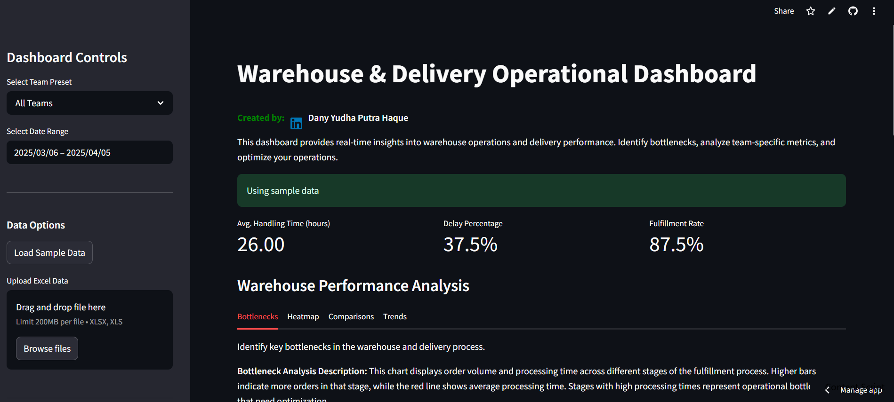

# Warehouse & Delivery Operational Dashboard


Interactive dashboard for warehouse and delivery operational metrics that identifies bottlenecks and provides team-specific preset views to improve efficiency across the supply chain.

## Features

- **Team-Specific Presets**: Tailored views for Brand, Performance, and Social Media teams
- **Bottleneck Analysis**: Identify critical bottlenecks in warehouse and delivery processes
- **Performance Comparison**: Compare multiple warehouses across key metrics
- **Time Trend Analysis**: Track operational efficiency over time
- **Data Import/Export**: Support for database, Excel files, and sample data
- **Actionable Insights**: Team-specific recommendations to improve operational efficiency

## Project Structure

```
├── app.py                  # Main Streamlit application
├── database.py             # Database connectivity and query functions
├── data_processor.py       # Data calculation and transformation functions
├── visualizations.py       # Chart creation and visualization components
├── utils.py                # Utility functions for data formatting and recommendations 
├── sample_data.py          # Sample data generator for testing
└── .streamlit/
    └── config.toml         # Streamlit configuration
```

## Key Components

1. **Data Management Layer**
   - PostgreSQL database integration
   - Excel file upload functionality
   - Sample data generation for testing
   - Data filtering by date range and team

2. **Data Processing Engine**
   - Average handling time calculation
   - Delay percentage metrics
   - Fulfillment rate analysis
   - Warehouse performance aggregation

3. **Visualization Framework**
   - Bottleneck identification charts
   - Warehouse performance heatmaps
   - Performance comparison bar charts
   - Time-series trend analysis

4. **Analytics Dashboard**
   - Key metric cards (handling time, delays, fulfillment)
   - Slowest warehouse identification
   - Team-specific recommendations
   - Operational insights based on current metrics

## Key Metrics

The dashboard tracks and analyzes the following key operational metrics:

- **Average Handling Time**: Time taken to process orders (in hours)
- **Delay Percentage**: Percentage of orders delivered after expected date
- **Fulfillment Rate**: Percentage of orders successfully fulfilled
- **Processing Time**: Time spent in each processing stage
- **Warehouse Efficiency**: Combined performance score for each warehouse
- **Bottleneck Severity**: Critical path analysis for order processing

## Team-Specific Presets

A distinctive feature of this dashboard is the team-specific preset views:

- **Brand Team**: Focus on brand reputation metrics and premium product handling
- **Performance Team**: Warehouse efficiency and process optimization insights
- **Social Media Team**: Campaign impact on warehouse operations and pre-stocking needs
- **All Teams**: Complete overview of all operational metrics

## Usage

The application runs on Streamlit and provides an interactive interface for:
- Filtering data by date range and team
- Analyzing warehouse performance across different dimensions
- Identifying critical bottlenecks in the supply chain
- Exporting data for further analysis
- Loading data from multiple sources (database, Excel, sample data)

## Data Sources

The dashboard supports multiple data sources:
- PostgreSQL database (primary source)
- Excel file upload (for custom analysis)
- Sample data generation (for testing and demonstrations)

## Getting Started

1. Ensure your environment has the required packages (Streamlit, Pandas, Plotly, etc.)
2. Configure database connection (optional, sample data is available)
3. Run the application:
   ```
   streamlit run app.py
   ```

## Customization

The dashboard can be customized for specific business needs:
- Add new metrics by extending the data processor module
- Create additional visualizations in the visualization module
- Implement new team-specific presets based on business roles
- Customize the recommendation engine for specific operations

## Future Enhancements

Planned improvements include:
- Predictive analytics for demand forecasting
- Advanced bottleneck detection algorithms
- Real-time alert system for operational issues
- Supplier performance integration
- Mobile-optimized interface for warehouse managers
